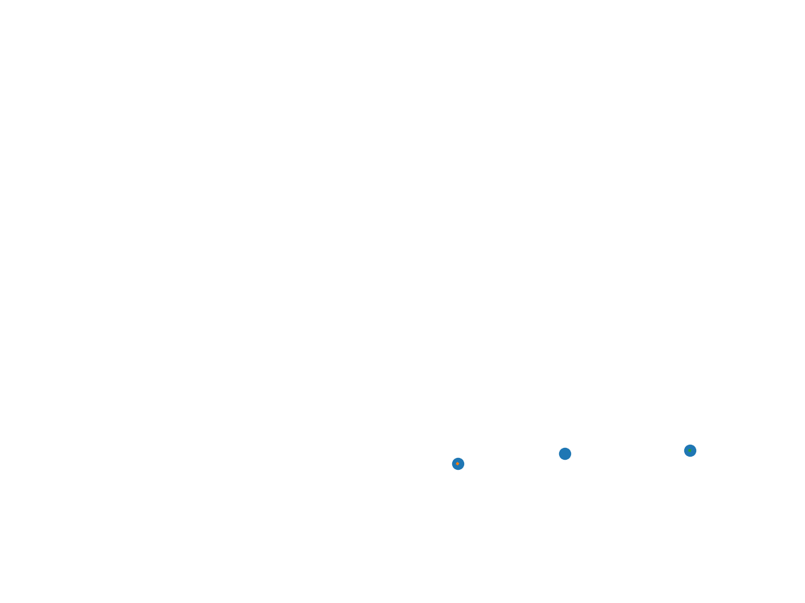
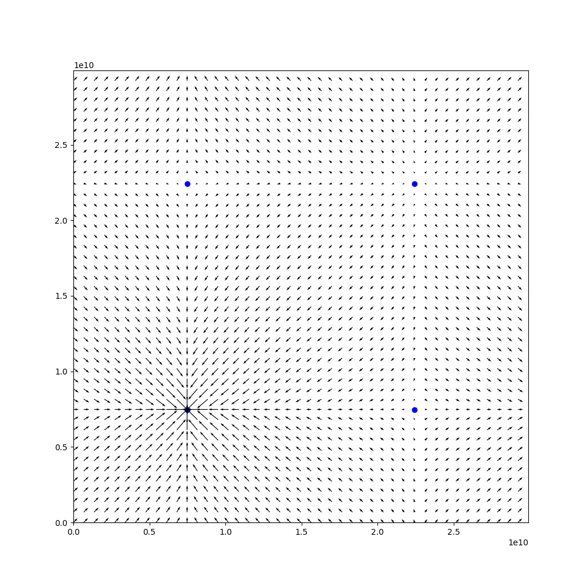

# JAX Gravity
This repo contains a demo of how to use JAX to create a simple gravity simulation. The script `main.py` uses JAX's experimental `ode` package to solve the differential equation.



One cool thing about this demo is that it creates a function called `gravity` that only calculates the force between two bodies, and then uses `jax.vmap` twice to transform it into a function that calculates the force between all pairs of bodies.

### Toroidal Space
Additionally, the script `main_toroidal.py` implements a gravitational simulation in an approximation to a toroidal space.
A toroidal topology can be represented by tessellating a rectangle into an infinite plane and then using [periodic boundary conditions](https://hal.science/hal-00136101v2/). Here we approximate the space by using a finite number of replicas.


In this simulation we only use a grid of 3x3 replicas as its faster to compute, and the results are more satisfying to watch.
To perform the simulation we use [diffrax](https://github.com/patrick-kidger/diffrax).

We can also visualize the gravitational field in this space. The following image shows the gravitational field of a single body in the bottom left of the grid, `(L/4, L/4)`. 



We see that the gravitational field in this space has 4 fixed points, 1 stable fixed on the body, and 3 unstable fixed points at `(L/4, 3L/4)`, `(3L/4, L/4)`, and `(3L/4, 3L/4)`. These unstable points are equidistant from the body in this space. To get this approximation we used a grid of 401x401 replicas.

## Instalation

### pip
```bash
pip install -r requirements.txt
```

### poetry
```bash
poetry install
```

## Usage
Upon running running the following command, you should the animation of the simulation.

```bash
python main.py
```

Change the parameters for fun :)